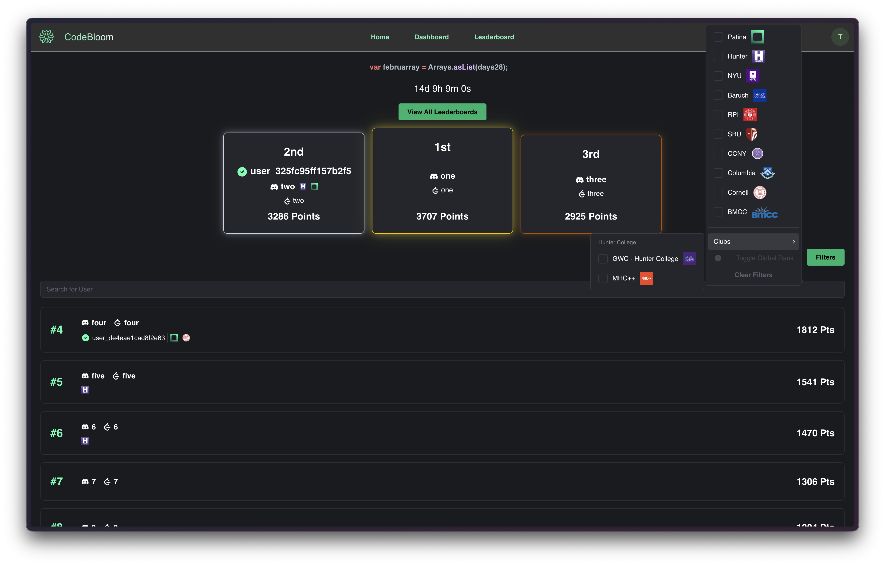

<h1 style="display: flex; gap: 10px; align-items: center;">
  
  <a href="https://codebloom.patinanetwork.org">
    codebloom.patinanetwork.org
  </a>
</h1>

Codebloom is a leaderboard system that game-ifies the aspect of solving LeetCode problems in order to help motivate engineers of all levels (students, new grads, FTEs) study for their technical interviews.

## Features

_Last updated: 02/14/2026_

Codebloom features include

- [User profiles with submission history]()
- [Automatic LeetCode syncing in the background]()
- [University-specific leaderboards]()
- [Problem Of The Day]()
- [Automatic achievements]()
- [Embeddable widgets]()
- [Dynamic question scoring]()
- [Live multiplayer duels]()
- [Club/organization integrations via Discord servers]()

[Goto `docs/features` to view all feature documentation](./docs/features)

## Structure

_Last updated: 02/14/2026_

This repository is a monorepo that contains many different pieces of Codebloom, which include:

- Our public task board on [Notion](https://www.notion.so/) which is used to define a relationship between tasks and PRs
  - [View public taskboard](https://codebloom.notion.site/)
  - [Goto `.github/scripts/notion/index.ts` to view custom PR/commit check validation implementation](./.github/scripts/notion/index.ts)
- Our backend which is written in [Java 25](https://dev.java/) and [Spring Boot 3](https://spring.io/projects/spring-boot). The backend interfaces with our database via [pgJDBC](https://jdbc.postgresql.org/), Discord via [JDA](https://jda.wiki/), [leetcode.com](https://leetcode.com) via a custom abstraction over their [GraphQL](https://graphql.org/) API as well as [Playwright](https://playwright.dev/java/) to obtain credentials to [leetcode.com](https://leetcode.com) via [GitHub OAuth](https://github.com).
  - [Goto `src/`](./src/)
  - [View detailed documentation](./src/README.md)
  - [View OpenAPI schema](https://codebloom.patinanetwork.org/swagger-ui/index.html)
- Our main database is [PostgreSQL 16](https://www.postgresql.org/), which is controlled with [Flyway](https://www.red-gate.com/products/flyway/community/) migrations.
  - [Goto `db/`](./db/)
  - [View detailed documentation](./db/README.md)
- Our frontend which is written in [TypeScript](https://www.typescriptlang.org/) and [React 18](https://www.typescriptlang.org/) + [Vite](https://vite.dev/).
  - [Goto `js/`](./js/)
  - [View detailed documentation](./js/README.md)
- Our email templater which utilizes [React Email](https://react.email/) and is dynamically parsed & templated at runtime with [JSoup](https://jsoup.org/) in our backend.
  - [Goto `email/`](./email/)
  - [View detailed documentation](./email/README.md)
- Our CI/CD pipeline which utilizes [GitHub Actions](https://github.com/features/actions) with [TypeScript](https://typescriptlang.org/) + [Bun Shell](https://bun.com/docs/runtime/shell). These scripts utilize the [Notion SDK](https://github.com/makenotion/notion-sdk-js), the [DigitalOcean DoTs SDK](https://github.com/digitalocean/dots) and the [Octokit SDK](https://github.com/octokit/octokit.js).
  - [Goto `.github/`](./.github/)
  - [Goto `.github/scripts/` to view all Bun Shell scripts](./.github/scripts/)
  - [View detailed documentation](./.github/README.md)
- Our service gets deployed to two environments (production & staging) in [DigitalOcean App Platform](https://www.digitalocean.com/products/app-platform), which is defined using infrastructure-as-code. We containerize the main application with [Docker](https://www.docker.com/) and monitor metrics & logs with [Prometheus](https://prometheus.io/) & [OpenSearch](https://opensearch.org/) which get fed to [Grafana](https://grafana.com/).
  - [Goto `.github/scripts/redeploy/` to view Bun Shell redeploy scripts](./.github/scripts/redeploy/)
  - [Goto `infra/`](./infra/)
  - [View DigitalOcean spec](./.do/README.md)
  - [View detailed documentation](./infra/README.md)
  - [View observability documentation](./docs/observability/README.md)
- Our internal tools (e.g. custom Ink CLI scripts & our internal standup bot) are currently being written in [Rust](https://rust-lang.org/) and [TypeScript](https://typescriptlang.org)
  - [Goto `internal/`](./internal/)
  - [View detailed documentation](./internal/README.md)
- Our secrets across all environments which are decryped with [git-crypt](https://github.com/AGWA/git-crypt).
  - [Goto `example.env`](./example.env)
  - [View detailed documentation](./docs/secrets/README.md)

## Setup

Please go to [`docs/setup/README.md`](./docs/local/README.md) to begin setup instructions for local development.

## Authors

The primary developer of the Codebloom development team is Tahmid Ahmed. If you have any inquires or questions, please direct them to him.

The rest of the core development team is:

- Alfardil Alam
- Alisha Zaman
- Angela Yu
- Arshadul Monir
- Nancy Huang

> [!NOTE]
> Codebloom is open-source and happily accepts contributions from the community. However, all pull requests are subject to review by the development team. Please click [here](./CONTRIBUTING.md) to learn more.

## LICENSE

The license can be found under [`./LICENSE`](./LICENSE)
