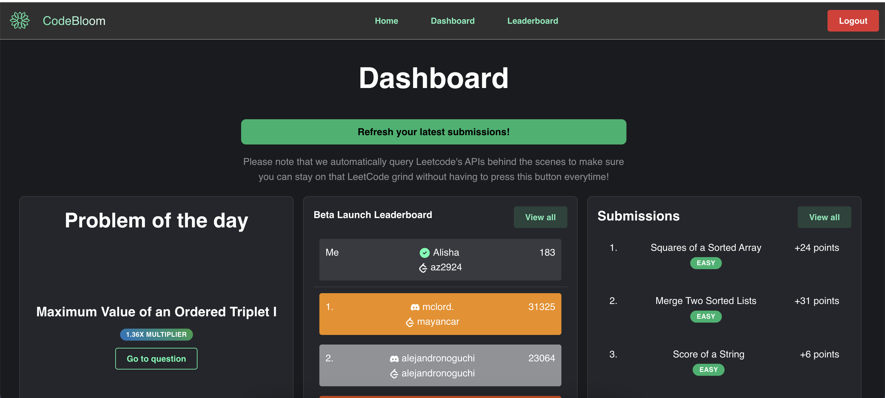
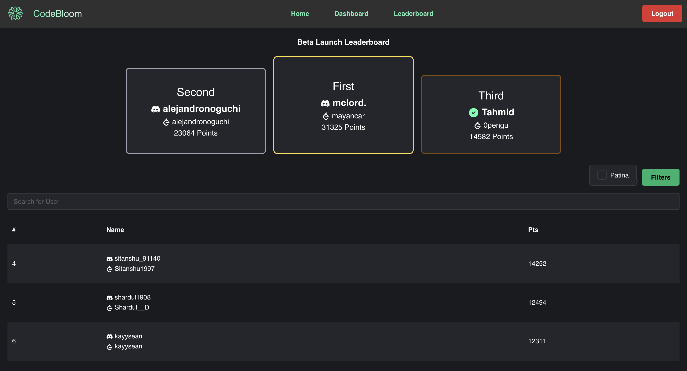
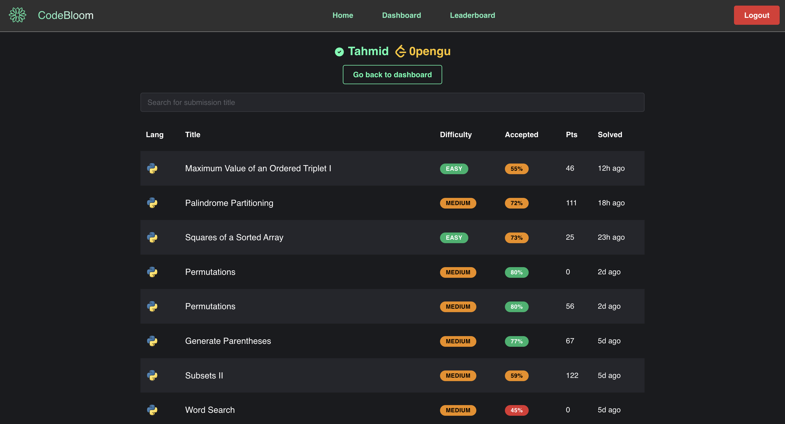

<!-- Improved compatibility of back to top link: See: https://github.com/othneildrew/Best-README-Template/pull/73 -->

<!--
*** Thanks for checking out the Best-README-Template. If you have a suggestion
*** that would make this better, please fork the repo and create a pull request
*** or simply open an issue with the tag "enhancement".
*** Don't forget to give the project a star!
*** Thanks again! Now go create something AMAZING! :D
-->

<!-- PROJECT SHIELDS -->
<!--
*** I'm using markdown "reference style" links for readability.
*** Reference links are enclosed in brackets [ ] instead of parentheses ( ).
*** See the bottom of this document for the declaration of the reference variables
*** for contributors-url, forks-url, etc. This is an optional, concise syntax you may use.
*** https://www.markdownguide.org/basic-syntax/#reference-style-links
-->

[![Contributors][contributors-shield]][contributors-url]
[![Forks][forks-shield]][forks-url]
[![Stargazers][stars-shield]][stars-url]
[![Issues][issues-shield]][issues-url]

<!-- PROJECT LOGO -->
 

  

<h3 align="center">Codebloom</h3>

  

     
    <a href="https://codebloom.patinanetwork.org">View Website</a>
    &middot;
    <a href="https://codebloom.notion.site/">View Current Tasks</a>
    &middot;
    <a href="https://github.com/tahminator/codebloom/issues/new?labels=bug&template=bug-report---.md">Report Bug</a>
    &middot;
    <a href="https://github.com/tahminator/codebloom/issues/new?labels=enhancement&template=feature-request---.md">Request Feature</a>
  

<!-- ABOUT THE PROJECT -->

## About The Project

CodeBloom aims to motivate Patina Network community reach their LeetCode goals by being able to track their progress, rank them on a leaderboard, and push them to complete the daily challenge to incentivize them.

---

## Technical Stack

Frontend:

Backend:

Infrastructure:

Development Tools:

Error Reporting:

---

## Authors

-   [Tahmid Ahmed](https://github.com/tahminator) - Lead Developer
-   [Alfardil Alam](https://github.com/alfardil) - Developer
-   [Alisha Zaman](https://github.com/az2924) - Developer
-   [Angela Yu](https://github.com/angelayu0530) - Developer
-   [Arshadul Monir](https://github.com/Arshadul-Monir) - Developer
-   [Nancy Huang](https://github.com/naanci) - Developer

---

> [!NOTE]
> Codebloom is open-source and happily accepts contributions from the community. However, all pull requests are subject to review by the development team. Please click [here](https://github.com/tahminator/codebloom/wiki/Contributing) to learn more.

---

<!-- INSTRUCTIONS -->

### Wiki:

For setup instructions as well as technical documentation (and much more), click [here](https://github.com/tahminator/codebloom/wiki) to reach our wiki page!

---

### Top contributors:

 

<!-- MARKDOWN LINKS & IMAGES -->
<!-- https://www.markdownguide.org/basic-syntax/#reference-style-links -->

[contributors-shield]: https://img.shields.io/github/contributors/tahminator/codebloom.svg?style=for-the-badge
[contributors-url]: https://github.com/tahminator/codebloom/graphs/contributors
[forks-shield]: https://img.shields.io/github/forks/tahminator/codebloom.svg?style=for-the-badge
[forks-url]: https://github.com/tahminator/codebloom/network/members
[stars-shield]: https://img.shields.io/github/stars/tahminator/codebloom.svg?style=for-the-badge
[stars-url]: https://github.com/tahminator/codebloom/stargazers
[issues-shield]: https://img.shields.io/github/issues/tahminator/codebloom.svg?style=for-the-badge
[issues-url]: https://github.com/tahminator/codebloom/issues
[license-shield]: https://img.shields.io/github/license/tahminator/codebloom.svg?style=for-the-badge
[license-url]: https://github.com/tahminator/codebloom/blob/master/LICENSE.txt
[linkedin-shield]: https://img.shields.io/badge/-LinkedIn-black.svg?style=for-the-badge&logo=linkedin&colorB=555
[linkedin-url]: https://linkedin.com/in/linkedin_username
[product-screenshot1]: js/public/screenshot1.png
[product-screenshot2]: js/public/screenshot2.png
[product-screenshot3]: js/public/screenshot3.png
[Next.js]: https://img.shields.io/badge/next.js-000000?style=for-the-badge&logo=nextdotjs&logoColor=white
[Next-url]: https://nextjs.org/
[React.js]: https://img.shields.io/badge/React-20232A?style=for-the-badge&logo=react&logoColor=61DAFB
[React-url]: https://reactjs.org/
[Vue.js]: https://img.shields.io/badge/Vue.js-35495E?style=for-the-badge&logo=vuedotjs&logoColor=4FC08D
[Vue-url]: https://vuejs.org/
[Angular.io]: https://img.shields.io/badge/Angular-DD0031?style=for-the-badge&logo=angular&logoColor=white
[Angular-url]: https://angular.io/
[Svelte.dev]: https://img.shields.io/badge/Svelte-4A4A55?style=for-the-badge&logo=svelte&logoColor=FF3E00
[Svelte-url]: https://svelte.dev/
[Laravel.com]: https://img.shields.io/badge/Laravel-FF2D20?style=for-the-badge&logo=laravel&logoColor=white
[Laravel-url]: https://laravel.com
[Bootstrap.com]: https://img.shields.io/badge/Bootstrap-563D7C?style=for-the-badge&logo=bootstrap&logoColor=white
[Bootstrap-url]: https://getbootstrap.com
[JQuery.com]: https://img.shields.io/badge/jQuery-0769AD?style=for-the-badge&logo=jquery&logoColor=white
[JQuery-url]: https://jquery.com
